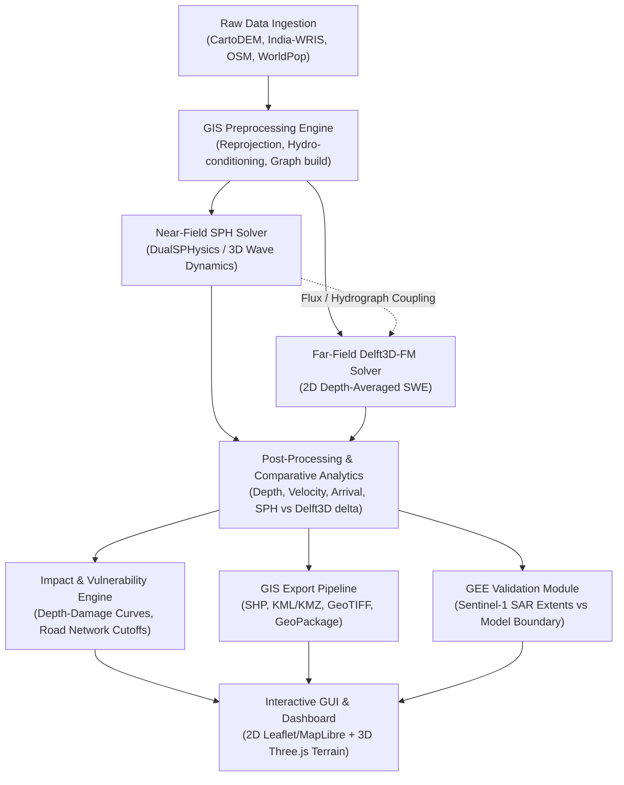

# SIH26161: Automated Dam-Break Simulation & Inundation Analysis Framework

## 1. Project Overview & Goal

**SIH26161** is an automated computational framework designed to simulate, analyze, and visualize dam-break flood wave propagation and its socio-economic impacts. The system bridges high-fidelity computational fluid dynamics with regional hydrodynamics by coupling:
1. **Smoothed Particle Hydrodynamics (SPH)** for near-field violent free-surface dam-break breach and wave generation.
2. **Delft3D (Flexible Mesh / 2D Shallow Water Equations)** for far-field downstream valley propagation, inundation spreading, and recession.
3. **Multi-Sector Vulnerability & Damage Engine** assessing infrastructure, agricultural, building, and road network disruptions.
4. **Interactive 2D/3D Visualization GUI** enabling emergency planners and dam safety engineers to configure breach scenarios, inspect flood hydrodynamics, and export decision-ready GIS layers.
5. **Earth Observation (GEE / Sentinel-1 SAR) Validation Pipeline** providing automated change detection and flood extent calibration against historical satellite observations.

---

## 2. Core Functional Requirements

* **Automated Data Ingestion & Preprocessing**:
  * Seamless ingest of high-resolution digital elevation models (DEMs), bathymetry, and reservoir stage-storage curves.
  * Standardized reprojection into planar metric CRS (e.g. UTM Zone 43N / EPSG:32643) with hydro-enforcement and sink filling.
  * Ingestion of OpenStreetMap (OSM) infrastructure assets, critical facilities, and road network topologies.
* **Dual-Engine Hydrodynamic Modeling & Intercomparison**:
  * Coupling/comparison between Lagrangian particle hydrodynamics (SPH, e.g. DualSPHysics / SPHysics) and Eulerian shallow water solvers (Delft3D-FM / D-Flow FM).
  * Automated generation of peak inundation depth ($h_{max}$), peak velocity ($v_{max}$), flood wave arrival time ($t_{arr}$), and depth-velocity hazard rating ($H = h \times v$).
* **Asset Exposure & Evacuation Analytics**:
  * Intersecting flood extents with critical infrastructure (buildings, schools, hospitals, power substations).
  * Network accessibility routing using road graphs (GraphML / OSMnx) to identify severed bridges, submerged road segments, and isolated population clusters.
* **Interoperable Geospatial Export**:
  * Automated batch export to standard GIS formats: ESRI Shapefile (`.shp`), Keyhole Markup Language (`.kml` / `.kmz`), GeoPackage (`.gpkg`), and Cloud-Optimized GeoTIFF (`.tif`).
* **Remote Sensing Verification**:
  * Google Earth Engine (GEE) integration for automated Sentinel-1 C-band SAR backscatter thresholding (Otsu method) to validate model-predicted inundation boundaries against actual historical flood footprints.
* **Modern Decision-Support GUI**:
  * Interactive map viewer with temporal playback of flood wave progression, 3D terrain rendering (WebGL / Three.js), scenario comparison dashboards, and one-click evacuation report generation.

---

## 3. System Architecture



---

## 4. Technology Stack

* **Core Language & Backend**: Python 3.10+ (NumPy, SciPy, Numba, Pandas).
* **Geospatial Processing**: GDAL / OGR, Rasterio, GeoPandas, Shapely, PyProj, Fiona.
* **Network & Graph Analytics**: NetworkX, OSMnx, SciPy Spatial (cKDTree).
* **Remote Sensing**: Google Earth Engine Python API (`earthengine-api`), Geemap.
* **Hydrodynamic Modeling Interfaces**:
  * Delft3D-FM / D-Flow FM OpenDA / Dimr tools and netCDF4 UGRID parsers.
  * SPH particle file converters (VTK, CSV, HDF5) and SPH-to-raster surface interpolators.
* **3D Visualization & Front-End**:
  * WebGL, Three.js, `geotiff.js` (browser-based 3D terrain elevation).
  * Desktop / Web GUI: Electron / Modern Web View or PyQt/PySide6 with MapLibre GL / Leaflet tile renderers.
* **Data Storage & Serialization**: GeoTIFF, GeoPackage (`.gpkg`), GeoJSON, GraphML, netCDF4.

---

## 5. Current Workspace Datasets & Characterization

#### 5.1 Hidkal Dam Case Study (`data/raw/data_hidkal/`)
* **`hidkal_dem.tif`**: 700 x 600 Float32, EPSG:4326. Pixel size: 0.0004° x 0.00033333° (~44.4 m x ~36.9 m). Bounds: 74.60°E - 74.88°E, 16.12°N - 16.32°N. Numeric range: 600.0001 to 682.5; elevation unit and vertical datum unverified.
* **`hidkal_depth.tif`**: 700 x 600 Float32, EPSG:4326. Depth zero: 284,904; positive: 135,096; max: 13.3386. Unverified sample raster of unknown provenance.
* **`hidkal_velocity.tif`**: 700 x 600 Float32, EPSG:4326. Velocity zero: 294,000; positive: 126,000; max: 21.5660. Unverified sample raster of unknown provenance.
* **`hidkal_arrival.tif`**: 700 x 600 Float32, EPSG:4326. Total pixels: 420,000; `+9999`: 294,000; valid: 126,000; `-9999`: 0; metadata NoData: `-9999`; valid range: 7.0–66.5, unit unknown. Unverified sample raster of unknown provenance.
* **`hidkal_assets.geojson`**: 513 OSM infrastructure features (333 building polygons, 102 transport/bridge linestrings, 78 place/amenity points).
* **`hidkal_roads.graphml`**: OSMnx-derived routable directed network with 3,084 nodes and 8,047 edges with length, highway type, lanes, and geometry attributes.

### 5.2 Standalone Terrain Demo (`data/raw/tifToTerrain/`)
* **`default.tif`**: Tiled Int16 GeoTIFF, 219 x 346 pixels, EPSG:4326. Bounds: 70.81°E - 70.87°E, 22.76°N - 22.86°N (Morbi district, Gujarat). Located ~760 km northwest of Hidkal.
* **`new.html`**: Three.js WebGL terrain demo with smoothing filter. Kept strictly segregated as an architectural reference for client-side 3D rendering.

---

## 6. Known vs. Unknown Units & Parameter Specifications

| Parameter | Current Representation | Status | Scientific Assessment & Target Unit |
| :--- | :--- | :--- | :--- |
| **Topography (`dem`)** | Float32, 600.0001 to 682.5 | **Unverified** | Numeric range 600.0001–682.5; elevation unit and vertical datum unverified. |
| **Flood Depth (`depth`)** | Float32, max 13.3386 | **Unverified** | Depth zero: 284,904; positive: 135,096. Unverified sample raster of unknown provenance. |
| **Velocity (`velocity`)** | Float32, max 21.5660 | **Unverified** | Velocity zero: 294,000; positive: 126,000. Unit unverified; unverified sample raster of unknown provenance. |
| **Arrival Time (`arrival`)** | Float32, 7.00 to 66.50 | **Unknown / Inconsistent** | Total pixels: 420,000; `+9999`: 294,000; valid: 126,000; `-9999`: 0; metadata NoData: `-9999`; valid range: 7.0–66.5, unit unknown. Unverified sample raster of unknown provenance. |
| **NoData Encoding** | `-9999` in header vs `9999.0` in array | **Inconsistent** | Tag discrepancy detected in `hidkal_arrival.tif`. Must be normalized to standard IEEE NaN or explicit masking. |
| **Spatial Coordinate System** | EPSG:4326 (Degrees) | **Known (Geographic)** | Non-metric. Must be reprojected to UTM Zone 43N (meters) for slope, flux, and area calculations. |

---

## 7. Scientific & Physical Limitations

1. **Unverified Simulation Warning**:
   > [!WARNING]
   > The existing flood rasters (`hidkal_depth.tif`, `hidkal_velocity.tif`, `hidkal_arrival.tif`) are **unverified sample rasters of unknown provenance**. They must **never** be presented as validated hydrodynamic simulations or official hazard boundaries. Formal calibration against mass conservation, inflow breach hydrographs, downstream channel roughness (Manning's $n$), and real event records is mandatory before operational use.

2. **SPH vs. Delft3D Multi-Scale Discrepancies**:
   * *SPH*: Lagrangian particle method solving Navier-Stokes equations with free surface tracking. Highly accurate for steep 3D wave fronts, splash, turbulence, and impact forces on dam structures, but computationally prohibitive for large regional floodplains ($>10^7$ particles required).
   * *Delft3D-FM*: Eulerian 2D Shallow Water Equations (SWE) assuming hydrostatic pressure distribution ($\partial p/\partial z = -\rho g$). Exceptional computational efficiency and bed friction representation for 10s-100s of kilometers downstream, but incapable of capturing vertical accelerations, 3D wave breaking, or structural slamming at the breach initiation zone.
   * *Coupling Challenge*: Handshake interface between 3D particle fluxes and 2D mesh boundary conditions requires rigorous momentum and mass conservation conversion.

3. **Geographic Coordinate Distortions**:
   * In EPSG:4326, pixel dimensions are anisotropic ($0.0004^\circ \approx 44.4\text{ m}$ lon vs $0.00033333^\circ \approx 36.9\text{ m}$ lat at $16^\circ\text{N}$). Direct spatial kernel operations in geographic degrees introduce directional bias.

4. **Arrival NoData Mismatch**:
   * The `hidkal_arrival.tif` raster contains `+9999.0` for 294,000 unflooded cells despite declaring `-9999` in metadata. This requires an explicit data sanitizer before running spatial statistics or visualization color ramps.

5. **Disconnection of `default.tif`**:
   * `default.tif` lies in Morbi, Gujarat, while Hidkal is in Belagavi, Karnataka. It must not be mixed into the Hidkal analytical pipeline.

---

## 8. Generalized Dam / River Ingestion Architecture (Phase 18)

* **Minimal Dataset Onboarding**:
  * Decoupled dam onboarding from mandatory vector shapefiles / GeoJSON.
  * Ingestion requirements: `project_name`, `dam_name`, `latitude`, `longitude` (WGS84 decimal degrees), and a valid single-band GeoTIFF DEM (`dem_file`).
  * Vector dam axis file (`dam_axis_file`) is strictly optional. When omitted, the system generates a synthesized dam point marker geometry (`GET /api/dam-projects/{id}/geometry/dam-marker`).
* **Engineering Parameters & Physical Validation**:
  * Optional fields: `dam_height`, `crest_elevation`, `pool_elevation`, `manning_n`.
  * Automatic physical consistency check: validates `crest_elevation > pool_elevation` and computes `freeboard = crest_elevation - pool_elevation`.
  * Interrogates DEM elevation at dam location during ingestion and records sampled elevation.
* **Pre-Simulation Readiness Assessment (`GET /api/dam-projects/{id}/readiness`)**:
  * Explicitly distinguishes between **Screening Readiness** (DEM, dam location, metadata valid) and **Full ANUGA Hydrodynamic Simulation Readiness** (requires dam axis boundary/polyline, reservoir stage-storage/pool elevation, simulation boundary, downstream Manning's n).
  * Prevents premature simulation execution attempts and clearly enumerates missing inputs and recommended next steps.
* **Scientific Integrity Invariant**:
  * Every ingested custom project strictly maintains:
    ```python
    scientific_status = "validated_unverified"
    scientifically_verified = False
    ```
  * User-supplied DEMs and parameters are treated as uncalibrated engineering inputs until real observational calibration data is provided.

---

## 9. Generalized ANUGA Hydrodynamic Simulation Framework (Phase 19)

* **Progressive 5-Tier Readiness Model**:
  * The transition from raw DEM ingestion to hydrodynamic wave propagation is evaluated against five progressive readiness tiers:
    1. **Data Tier** (`data_ready`): Clean, single-band metric DEM, valid bounding coordinates, and dam location marker.
    2. **Geometry Tier** (`geometry_ready`): Dam axis polyline, enclosed 2D model domain polygon, and boundary outlet polyline.
    3. **Hydraulic Tier** (`hydraulic_ready`): Upstream reservoir initial water surface pool polygon/elevation, breach geometry & timing parameters, and downstream Manning roughness coefficient ($n$).
    4. **Solver Tier** (`solver_ready`): Unstructured mesh resolution parameters, target simulation duration, output write frequency, and numerical time-stepping tolerances.
    5. **Simulation Tier** (`simulation_ready`): Complete alignment of Tiers 1–4 plus dynamic host environment ANUGA solver readiness.
  * Systematically audited via `GET /api/dam-projects/{id}/readiness` with explicit `tier_breakdown`.

* **Terrain-Heuristic Hydraulic Assist & Scientific Boundaries**:
  * When authoritative surveyed vector boundaries are absent, the system provides a DEM slope gradient aspect calculator (`POST /api/dam-projects/{id}/heuristic-assist`) to derive candidate dam axis, breach opening, downstream floodway domain, and upstream reservoir extents.
  * **Critical Scientific Invariant**:
    > [!IMPORTANT]
    > A terrain DEM alone does NOT provide reservoir bathymetry, stage-storage volume, breach mechanics, or calibrated roughness.
    > All heuristically derived features are permanently stamped:
    > - `source = "terrain_heuristic"`
    > - `scientifically_verified = false`
    > - `confidence = "low_unverified"`
    > The system strictly refuses to persist these features (`POST /api/dam-projects/{id}/simulation-inputs`) unless the user explicitly acknowledges `accept_heuristic_inputs = true`.
  * **Topological Containment**:
    - Synthetic reservoir polygons are algorithmically guaranteed to lie strictly within the computational domain polygon and share a co-incident edge with the dam barrier.

* **Package Builder & Cryptographic Provenance**:
  * Produces an immutable, stand-alone reproduction package (`GET /api/dam-projects/{id}/anuga/download-package`) containing:
    - Executable simulation script (`run_anuga_project.py`) with parameter-hardcoded guards.
    - Post-processing pipeline (`postprocess_project.py`) converting unstructured ANUGA NetCDF SWW outputs to standardized GeoTIFF grids.
    - Cryptographic manifest (`run_manifest.json`) recording SHA-256 hashes of all input DEMs, boundaries, and parameter configurations.
    - Isolated conda environment recipe (`environment.yml`).
    - Explicit `README_REQUIREMENTS.txt` documenting scientific caveats.

* **7-State Execution Lifecycle & Gated Subprocess Management**:
  * Lifecycle state machine: `queued` $\rightarrow$ `preparing` $\rightarrow$ `running` $\rightarrow$ `postprocessing` $\rightarrow$ `completed` (or `failed`, `cancelled`, `timed_out`, `interrupted`).
  * Gated execution (`ENABLE_CUSTOM_ANUGA_EXECUTION=false` by default) returns HTTP 403 when ANUGA is unavailable, rejecting simulated "dummy" outputs.
  * Launches asynchronous background subprocesses with cancellation endpoints (`POST /api/dam-projects/{id}/anuga/runs/{run_id}/cancel`) and streaming log inspection (`GET /api/dam-projects/{id}/anuga/runs/{run_id}/logs`).

* **Rigorous Output Validation**:
  * NetCDF SWW verification ensures the simulation did not produce empty or unphysical outputs:
    - Checks file readability and schema compliance.
    - Verifies temporal progression ($\ge 2$ valid timesteps).
    - Asserts that hydrodynamic depth is strictly non-trivial ($\max(w - z) > 0.0001\text{ m}$).
  * Verified outputs are ingested into the platform hazard layer catalog for XYZ tile rendering, interactive point probing, and exposure screening.

---

## 10. Earth Observation & Satellite Comparison Architecture (Phase 20)

* **Dynamic Capability Discovery & Zero-Fabrication Fallback**:
  * Live inspection via `GET /api/gee/capabilities` checking Python `earthengine-api`, GCP Application Default Credentials (`ADC`), and `GEE_PROJECT_ID`.
  * **Zero-Fabrication Enforcement**:
    > [!CRITICAL]
    > If Google Earth Engine is unauthenticated, unavailable, or missing a project configuration, the system strictly REFUSES to generate fake Sentinel-1 SAR scenes, fake JRC water masks, or fake IMERG rainfall.
    > The fallback mode returns truthful status (`gee_unavailable`, `authentication_required`, `project_not_configured`, `no_imagery_available`) documenting the intended query parameters without fabricating observation outputs. Synthetic observations exist ONLY in isolated unit test fixtures (`synthetic_test_fixture=True`).

* **Project Area of Interest (AOI) Derivation**:
  * Dynamically derived via `GET /api/dam-projects/{id}/earth-observation/aoi?buffer_meters=` from simulation model domain or DEM extent.
  * Projects geometries into local UTM coordinates to apply a metric buffer (default 2,000 m) and calculates precise surface area in $\text{km}^2$.

* **Sentinel-1 SAR Flood Inundation & Configurable Heuristics**:
  * Dual-date backscatter change detection and single-date water thresholding.
  * Thresholds are configurable initial defaults:
    - `change_threshold_db = -3.0 dB`
    - `post_event_water_threshold_db = -15.0 dB`
    - Polarization: `VV`, `VH`, or `both`
  * Provenance permanently records `threshold_source = "configurable_heuristic"`.
  * Resulting pixels are strictly labeled `candidate_inundation` (never confirmed flood) due to radar layover/shadow, surface roughness, and vegetative backscatter limitations.

* **JRC Global Surface Water & GPM IMERG Rainfall Context**:
  * Differentiates permanent water bodies from transient flood events using JRC occurrence masks.
  * Ingests NASA GPM IMERG satellite precipitation accumulation and time series to provide rainfall context for the flood event.

* **Hydrodynamic Model vs. Observation Comparison Engine**:
  * Evaluates spatial agreement between 2D ANUGA hydrodynamic simulation rasters (`maximum_depth.tif`) and satellite observation masks (`POST /api/dam-projects/{id}/earth-observation/compare`).
  * Computes overlap ($\text{km}^2$), union ($\text{km}^2$), model-only ($\text{km}^2$), satellite-only ($\text{km}^2$), and Intersection over Union ($IoU$ / Jaccard Index).
  * **Metric Labeling Constraint**:
    - The metric is strictly labeled `"model-observation spatial agreement"`. It is NEVER described as "simulation accuracy" or "model validation".
  * **Configurable Temporal Validity**:
    - Evaluates reference time delta against configurable `max_observation_time_delta_hours` (default 72h).
    - Logs temporal mismatch warnings if satellite acquisition and simulation timestamps diverge beyond tolerance.

---

## 11. Multi-Engine Spatial Hydrodynamic Comparison Architecture (Phase 21)

* **Normalized Hydrodynamic Output Contract**:
  * Uniform contract (`HydrodynamicOutputContract`) normalizing outputs across ANUGA, Delft3D FM, and PySPH without fabricating missing rasters.
  * Preserves native CRS, native resolution, analysis CRS, analysis resolution, spatial bounds, SHA-256 layer hashes, run timestamps, and scientific status.
  * Independent availability flags: `maximum_depth_available`, `maximum_velocity_available`, `arrival_time_available`, `inundation_extent_available`.

* **Area Correctness & Projected Metric Analysis Grid**:
  * All area calculations ($\text{km}^2$) are computed strictly on an aligned metric Cartesian coordinate reference system (derived UTM zone or project DEM CRS), never from unprojected degree-based EPSG:4326 pixels.
  * Strict common valid analysis mask: evaluations are performed solely over pixels where both compared models contain valid data. Tracks `common_valid_pixel_count` and `common_analysis_area_km2`. NoData is never silently coerced to 0.0m water depth.
  * Resampling preserves integrity: bilinear continuous interpolation for depth/velocity/arrival-time; nearest-neighbour for categorical inundation masks. Full resampling method and grid provenance are recorded in `provenance.json`.

* **Honest Engine Capability Discovery**:
  * Distinguishes `environment_available`, `solver_available`, `completed_run_count`, `comparable_run_count`, and `available_for_comparison`.
  * If a solver has no real completed run with validated raster products, it is truthfully marked `available_for_comparison = false` with an explicit reason.

* **Inter-Model Difference & Spatial Agreement Metrics**:
  * **Inter-Model Depth Difference**:
    - Signed difference ($A - B$), mean signed difference, median signed difference, MAE, RMSE, max positive difference, and max negative difference.
    - Configurable tolerance band coverage ($\pm 0.10$ m, $\pm 0.25$ m, $\pm 0.50$ m) tracking percentage coverage of common analysis support.
    - Strictly labeled `"inter-model depth difference"` (never "model error").
  * **Inter-Model Spatial Agreement**:
    - Footprints derived from depth rasters using configurable threshold (default 0.10 m).
    - Computes overlap ($\text{km}^2$), union ($\text{km}^2$), Model A-only ($\text{km}^2$), Model B-only ($\text{km}^2$), and Intersection over Union ($IoU$ / Jaccard Index).
    - Strictly labeled `"inter-model spatial agreement"` (never "validation", "accuracy", or "truth").
  * **Velocity & Arrival-Time Comparisons**:
    - Velocity is compared only when both real runs contain valid velocity products; never synthesized.
    - Arrival-time comparison validates threshold definition compatibility (`threshold_definition_a`, `threshold_definition_b`). Divergent threshold definitions invalidate the comparison (`comparison_valid = false`) and suppress misleading RMSE metrics.
  * **Inter-Model Spread Diagnostic**:
    - Ensemble diagnostic across available models ($max - min$ depth, mean spread, max spread).
    - Strictly labeled `"inter-model spread"` (never "uncertainty", "confidence interval", or "probability").

* **Persistence & Secure Tile Access**:
  * Comparison runs are persisted under `runtime/dam_projects/{id}/comparisons/{comparison_id}/` storing `comparison.json`, `statistics.json`, `provenance.json`, `processing.log`, `depth_difference.tif`, `inundation_overlap.tif`, and `inter_model_spread.tif`.
  * Dynamic slippy map tiles served via `GET /api/dam-projects/{id}/model-comparison/runs/{comparison_id}/tiles/{layer}/{z}/{x}/{y}.png`.
  * Diverging color ramp semantics: Cyan = Engine A lower than Engine B; Gray = Similar; Red = Engine A higher than Engine B.

* **Frontend Comparison Studio (`ModelComparisonPanel.tsx`)**:
  * Mounted in Dam Onboarding Project Card with capability matrix badges, pairwise solver selection, KPI HUD, and prominent scientific caveats banner.

---

## 12. Exposure & Vulnerability Assessment Architecture (Phase 22)

* **Strict Distinction: Hazard vs. Exposure vs. Vulnerability vs. Loss/Damage**:
  * **Hazard**: Physical flood parameters modeled by hydrodynamic solvers (peak depth, velocity, arrival time).
  * **Exposure**: Co-occurrence of spatial assets/people with hazard zones above defined thresholds (`exposed population != casualties`; `inundated building != destroyed`; `flooded road != impassable`).
  * **Vulnerability**: Susceptibility to damage represented by empirical or physics-based depth-damage curves (e.g. JRC Global flood depth-damage functions).
  * **Damage / Loss**: Relative damage ratio (0.0 to 1.0) and monetary loss. Suppresses rupee figures (`monetary_damage = null`) unless validated local valuation databases exist.

* **Standardized Hazard Source Contract**:
  * Exposure runs accept completed hydrodynamic runs (`status == "completed"` and valid `maximum_depth.tif`).
  * Missing optional velocity or arrival rasters are truthfully flagged `available = false`; never synthesized.
  * Contract persists engine, run_id, SHA-256 layer hashes, native CRS, analysis CRS, depth threshold, timestamp, and scientific status.

* **Population Raster Semantics & Mass Conservation**:
  * Distinguishes `persons_per_cell` (counts) from `persons_per_sq_km` (density).
  * Prevents destructive bilinear interpolation for count rasters; applies mass-conservation scaling factor across reprojected/aligned grids.
  * For density rasters, integrates over pixel area in metric units.
  * Groups exposed population into configurable depth bands (default: 0.00-0.10m, 0.10-0.50m, 0.50-1.00m, 1.00-2.00m, 2.00-3.00m, >3.00m).
  * Labeled `"population exposed"` (never "casualties", "fatalities", or "people killed").

* **Building Footprints & Zonal Statistics**:
  * Prioritizes true polygon/raster overlap deriving max depth, mean depth, max velocity, earliest arrival, and flooded footprint area.
  * Uses representative interior point sampling as a documented fallback, recording sampling method in provenance.
  * Building usage classification is preserved strictly from source tags; never inferred from geometry alone.

* **Segmented Road Exposure & Metric Lengths**:
  * Segments road LineStrings against inundation extent in metric projected coordinates.
  * Calculates `total_road_length_km`, `affected_road_length_km`, and depth-band breakdowns.
  * Labeled `"potentially affected road segment"` (passability set to `road_passability_available = false` unless documented threshold exists).

* **Critical Infrastructure Categorization**:
  * Maps OSM tags to normalized categories (`healthcare`, `education`, `emergency`, `transport`, `substation`, `bridge`, `water_supply`) only when supported by source attributes.
  * Unlabeled or ambiguous features remain strictly `normalized_category = "unknown"` (never guessed).
  * Preserves `original_source_category`, `source_dataset`, and `source_feature_id`.

* **Categorical LULC Flood Analysis**:
  * Preserves categorical values using nearest-neighbour resampling exclusively.
  * Aggregates flooded area per source class code. Unmapped classes retained as `unknown / class_<value>`.

* **Vulnerability & Damage Separation**:
  * Evaluates relative damage ratios using documented JRC vulnerability curves only when asset class, hazard variable, and units match.
  * Monetary damage requires authoritative asset valuation datasets; returns `monetary_damage_available = false` and `monetary_damage = null` when valuations are absent. Zero fabricated rupee values.
5. **Disconnection of `default.tif`**:
   * `default.tif` lies in Morbi, Gujarat, while Hidkal is in Belagavi, Karnataka. It must not be mixed into the Hidkal analytical pipeline.

---

## 8. Generalized Dam / River Ingestion Architecture (Phase 18)

* **Minimal Dataset Onboarding**:
  * Decoupled dam onboarding from mandatory vector shapefiles / GeoJSON.
  * Ingestion requirements: `project_name`, `dam_name`, `latitude`, `longitude` (WGS84 decimal degrees), and a valid single-band GeoTIFF DEM (`dem_file`).
  * Vector dam axis file (`dam_axis_file`) is strictly optional. When omitted, the system generates a synthesized dam point marker geometry (`GET /api/dam-projects/{id}/geometry/dam-marker`).
* **Engineering Parameters & Physical Validation**:
  * Optional fields: `dam_height`, `crest_elevation`, `pool_elevation`, `manning_n`.
  * Automatic physical consistency check: validates `crest_elevation > pool_elevation` and computes `freeboard = crest_elevation - pool_elevation`.
  * Interrogates DEM elevation at dam location during ingestion and records sampled elevation.
* **Pre-Simulation Readiness Assessment (`GET /api/dam-projects/{id}/readiness`)**:
  * Explicitly distinguishes between **Screening Readiness** (DEM, dam location, metadata valid) and **Full ANUGA Hydrodynamic Simulation Readiness** (requires dam axis boundary/polyline, reservoir stage-storage/pool elevation, simulation boundary, downstream Manning's n).
  * Prevents premature simulation execution attempts and clearly enumerates missing inputs and recommended next steps.
* **Scientific Integrity Invariant**:
  * Every ingested custom project strictly maintains:
    ```python
    scientific_status = "validated_unverified"
    scientifically_verified = False
    ```
  * User-supplied DEMs and parameters are treated as uncalibrated engineering inputs until real observational calibration data is provided.

---

## 9. Generalized ANUGA Hydrodynamic Simulation Framework (Phase 19)

* **Progressive 5-Tier Readiness Model**:
  * The transition from raw DEM ingestion to hydrodynamic wave propagation is evaluated against five progressive readiness tiers:
    1. **Data Tier** (`data_ready`): Clean, single-band metric DEM, valid bounding coordinates, and dam location marker.
    2. **Geometry Tier** (`geometry_ready`): Dam axis polyline, enclosed 2D model domain polygon, and boundary outlet polyline.
    3. **Hydraulic Tier** (`hydraulic_ready`): Upstream reservoir initial water surface pool polygon/elevation, breach geometry & timing parameters, and downstream Manning roughness coefficient ($n$).
    4. **Solver Tier** (`solver_ready`): Unstructured mesh resolution parameters, target simulation duration, output write frequency, and numerical time-stepping tolerances.
    5. **Simulation Tier** (`simulation_ready`): Complete alignment of Tiers 1–4 plus dynamic host environment ANUGA solver readiness.
  * Systematically audited via `GET /api/dam-projects/{id}/readiness` with explicit `tier_breakdown`.

* **Terrain-Heuristic Hydraulic Assist & Scientific Boundaries**:
  * When authoritative surveyed vector boundaries are absent, the system provides a DEM slope gradient aspect calculator (`POST /api/dam-projects/{id}/heuristic-assist`) to derive candidate dam axis, breach opening, downstream floodway domain, and upstream reservoir extents.
  * **Critical Scientific Invariant**:
    > [!IMPORTANT]
    > A terrain DEM alone does NOT provide reservoir bathymetry, stage-storage volume, breach mechanics, or calibrated roughness.
    > All heuristically derived features are permanently stamped:
    > - `source = "terrain_heuristic"`
    > - `scientifically_verified = false`
    > - `confidence = "low_unverified"`
    > The system strictly refuses to persist these features (`POST /api/dam-projects/{id}/simulation-inputs`) unless the user explicitly acknowledges `accept_heuristic_inputs = true`.
  * **Topological Containment**:
    - Synthetic reservoir polygons are algorithmically guaranteed to lie strictly within the computational domain polygon and share a co-incident edge with the dam barrier.

* **Package Builder & Cryptographic Provenance**:
  * Produces an immutable, stand-alone reproduction package (`GET /api/dam-projects/{id}/anuga/download-package`) containing:
    - Executable simulation script (`run_anuga_project.py`) with parameter-hardcoded guards.
    - Post-processing pipeline (`postprocess_project.py`) converting unstructured ANUGA NetCDF SWW outputs to standardized GeoTIFF grids.
    - Cryptographic manifest (`run_manifest.json`) recording SHA-256 hashes of all input DEMs, boundaries, and parameter configurations.
    - Isolated conda environment recipe (`environment.yml`).
    - Explicit `README_REQUIREMENTS.txt` documenting scientific caveats.

* **7-State Execution Lifecycle & Gated Subprocess Management**:
  * Lifecycle state machine: `queued` $\rightarrow$ `preparing` $\rightarrow$ `running` $\rightarrow$ `postprocessing` $\rightarrow$ `completed` (or `failed`, `cancelled`, `timed_out`, `interrupted`).
  * Gated execution (`ENABLE_CUSTOM_ANUGA_EXECUTION=false` by default) returns HTTP 403 when ANUGA is unavailable, rejecting simulated "dummy" outputs.
  * Launches asynchronous background subprocesses with cancellation endpoints (`POST /api/dam-projects/{id}/anuga/runs/{run_id}/cancel`) and streaming log inspection (`GET /api/dam-projects/{id}/anuga/runs/{run_id}/logs`).

* **Rigorous Output Validation**:
  * NetCDF SWW verification ensures the simulation did not produce empty or unphysical outputs:
    - Checks file readability and schema compliance.
    - Verifies temporal progression ($\ge 2$ valid timesteps).
    - Asserts that hydrodynamic depth is strictly non-trivial ($\max(w - z) > 0.0001\text{ m}$).
  * Verified outputs are ingested into the platform hazard layer catalog for XYZ tile rendering, interactive point probing, and exposure screening.

---

## 10. Earth Observation & Satellite Comparison Architecture (Phase 20)

* **Dynamic Capability Discovery & Zero-Fabrication Fallback**:
  * Live inspection via `GET /api/gee/capabilities` checking Python `earthengine-api`, GCP Application Default Credentials (`ADC`), and `GEE_PROJECT_ID`.
  * **Zero-Fabrication Enforcement**:
    > [!CRITICAL]
    > If Google Earth Engine is unauthenticated, unavailable, or missing a project configuration, the system strictly REFUSES to generate fake Sentinel-1 SAR scenes, fake JRC water masks, or fake IMERG rainfall.
    > The fallback mode returns truthful status (`gee_unavailable`, `authentication_required`, `project_not_configured`, `no_imagery_available`) documenting the intended query parameters without fabricating observation outputs. Synthetic observations exist ONLY in isolated unit test fixtures (`synthetic_test_fixture=True`).

* **Project Area of Interest (AOI) Derivation**:
  * Dynamically derived via `GET /api/dam-projects/{id}/earth-observation/aoi?buffer_meters=` from simulation model domain or DEM extent.
  * Projects geometries into local UTM coordinates to apply a metric buffer (default 2,000 m) and calculates precise surface area in $\text{km}^2$.

* **Sentinel-1 SAR Flood Inundation & Configurable Heuristics**:
  * Dual-date backscatter change detection and single-date water thresholding.
  * Thresholds are configurable initial defaults:
    - `change_threshold_db = -3.0 dB`
    - `post_event_water_threshold_db = -15.0 dB`
    - Polarization: `VV`, `VH`, or `both`
  * Provenance permanently records `threshold_source = "configurable_heuristic"`.
  * Resulting pixels are strictly labeled `candidate_inundation` (never confirmed flood) due to radar layover/shadow, surface roughness, and vegetative backscatter limitations.

* **JRC Global Surface Water & GPM IMERG Rainfall Context**:
  * Differentiates permanent water bodies from transient flood events using JRC occurrence masks.
  * Ingests NASA GPM IMERG satellite precipitation accumulation and time series to provide rainfall context for the flood event.

* **Hydrodynamic Model vs. Observation Comparison Engine**:
  * Evaluates spatial agreement between 2D ANUGA hydrodynamic simulation rasters (`maximum_depth.tif`) and satellite observation masks (`POST /api/dam-projects/{id}/earth-observation/compare`).
  * Computes overlap ($\text{km}^2$), union ($\text{km}^2$), model-only ($\text{km}^2$), satellite-only ($\text{km}^2$), and Intersection over Union ($IoU$ / Jaccard Index).
  * **Metric Labeling Constraint**:
    - The metric is strictly labeled `"model-observation spatial agreement"`. It is NEVER described as "simulation accuracy" or "model validation".
  * **Configurable Temporal Validity**:
    - Evaluates reference time delta against configurable `max_observation_time_delta_hours` (default 72h).
    - Logs temporal mismatch warnings if satellite acquisition and simulation timestamps diverge beyond tolerance.

---

## 11. Multi-Engine Spatial Hydrodynamic Comparison Architecture (Phase 21)

* **Normalized Hydrodynamic Output Contract**:
  * Uniform contract (`HydrodynamicOutputContract`) normalizing outputs across ANUGA, Delft3D FM, and PySPH without fabricating missing rasters.
  * Preserves native CRS, native resolution, analysis CRS, analysis resolution, spatial bounds, SHA-256 layer hashes, run timestamps, and scientific status.
  * Independent availability flags: `maximum_depth_available`, `maximum_velocity_available`, `arrival_time_available`, `inundation_extent_available`.

* **Area Correctness & Projected Metric Analysis Grid**:
  * All area calculations ($\text{km}^2$) are computed strictly on an aligned metric Cartesian coordinate reference system (derived UTM zone or project DEM CRS), never from unprojected degree-based EPSG:4326 pixels.
  * Strict common valid analysis mask: evaluations are performed solely over pixels where both compared models contain valid data. Tracks `common_valid_pixel_count` and `common_analysis_area_km2`. NoData is never silently coerced to 0.0m water depth.
  * Resampling preserves integrity: bilinear continuous interpolation for depth/velocity/arrival-time; nearest-neighbour for categorical inundation masks. Full resampling method and grid provenance are recorded in `provenance.json`.

* **Honest Engine Capability Discovery**:
  * Distinguishes `environment_available`, `solver_available`, `completed_run_count`, `comparable_run_count`, and `available_for_comparison`.
  * If a solver has no real completed run with validated raster products, it is truthfully marked `available_for_comparison = false` with an explicit reason.

* **Inter-Model Difference & Spatial Agreement Metrics**:
  * **Inter-Model Depth Difference**:
    - Signed difference ($A - B$), mean signed difference, median signed difference, MAE, RMSE, max positive difference, and max negative difference.
    - Configurable tolerance band coverage ($\pm 0.10$ m, $\pm 0.25$ m, $\pm 0.50$ m) tracking percentage coverage of common analysis support.
    - Strictly labeled `"inter-model depth difference"` (never "model error").
  * **Inter-Model Spatial Agreement**:
    - Footprints derived from depth rasters using configurable threshold (default 0.10 m).
    - Computes overlap ($\text{km}^2$), union ($\text{km}^2$), Model A-only ($\text{km}^2$), Model B-only ($\text{km}^2$), and Intersection over Union ($IoU$ / Jaccard Index).
    - Strictly labeled `"inter-model spatial agreement"` (never "validation", "accuracy", or "truth").
  * **Velocity & Arrival-Time Comparisons**:
    - Velocity is compared only when both real runs contain valid velocity products; never synthesized.
    - Arrival-time comparison validates threshold definition compatibility (`threshold_definition_a`, `threshold_definition_b`). Divergent threshold definitions invalidate the comparison (`comparison_valid = false`) and suppress misleading RMSE metrics.
  * **Inter-Model Spread Diagnostic**:
    - Ensemble diagnostic across available models ($max - min$ depth, mean spread, max spread).
    - Strictly labeled `"inter-model spread"` (never "uncertainty", "confidence interval", or "probability").

* **Persistence & Secure Tile Access**:
  * Comparison runs are persisted under `runtime/dam_projects/{id}/comparisons/{comparison_id}/` storing `comparison.json`, `statistics.json`, `provenance.json`, `processing.log`, `depth_difference.tif`, `inundation_overlap.tif`, and `inter_model_spread.tif`.
  * Dynamic slippy map tiles served via `GET /api/dam-projects/{id}/model-comparison/runs/{comparison_id}/tiles/{layer}/{z}/{x}/{y}.png`.
  * Diverging color ramp semantics: Cyan = Engine A lower than Engine B; Gray = Similar; Red = Engine A higher than Engine B.

* **Frontend Comparison Studio (`ModelComparisonPanel.tsx`)**:
  * Mounted in Dam Onboarding Project Card with capability matrix badges, pairwise solver selection, KPI HUD, and prominent scientific caveats banner.

---

## 12. Exposure & Vulnerability Assessment Architecture (Phase 22)

* **Strict Distinction: Hazard vs. Exposure vs. Vulnerability vs. Loss/Damage**:
  * **Hazard**: Physical flood parameters modeled by hydrodynamic solvers (peak depth, velocity, arrival time).
  * **Exposure**: Co-occurrence of spatial assets/people with hazard zones above defined thresholds (`exposed population != casualties`; `inundated building != destroyed`; `flooded road != impassable`).
  * **Vulnerability**: Susceptibility to damage represented by empirical or physics-based depth-damage curves (e.g. JRC Global flood depth-damage functions).
  * **Damage / Loss**: Relative damage ratio (0.0 to 1.0) and monetary loss. Suppresses rupee figures (`monetary_damage = null`) unless validated local valuation databases exist.

* **Standardized Hazard Source Contract**:
  * Exposure runs accept completed hydrodynamic runs (`status == "completed"` and valid `maximum_depth.tif`).
  * Missing optional velocity or arrival rasters are truthfully flagged `available = false`; never synthesized.
  * Contract persists engine, run_id, SHA-256 layer hashes, native CRS, analysis CRS, depth threshold, timestamp, and scientific status.

* **Population Raster Semantics & Mass Conservation**:
  * Distinguishes `persons_per_cell` (counts) from `persons_per_sq_km` (density).
  * Prevents destructive bilinear interpolation for count rasters; applies mass-conservation scaling factor across reprojected/aligned grids.
  * For density rasters, integrates over pixel area in metric units.
  * Groups exposed population into configurable depth bands (default: 0.00-0.10m, 0.10-0.50m, 0.50-1.00m, 1.00-2.00m, 2.00-3.00m, >3.00m).
  * Labeled `"population exposed"` (never "casualties", "fatalities", or "people killed").

* **Building Footprints & Zonal Statistics**:
  * Prioritizes true polygon/raster overlap deriving max depth, mean depth, max velocity, earliest arrival, and flooded footprint area.
  * Uses representative interior point sampling as a documented fallback, recording sampling method in provenance.
  * Building usage classification is preserved strictly from source tags; never inferred from geometry alone.

* **Segmented Road Exposure & Metric Lengths**:
  * Segments road LineStrings against inundation extent in metric projected coordinates.
  * Calculates `total_road_length_km`, `affected_road_length_km`, and depth-band breakdowns.
  * Labeled `"potentially affected road segment"` (passability set to `road_passability_available = false` unless documented threshold exists).

* **Critical Infrastructure Categorization**:
  * Maps OSM tags to normalized categories (`healthcare`, `education`, `emergency`, `transport`, `substation`, `bridge`, `water_supply`) only when supported by source attributes.
  * Unlabeled or ambiguous features remain strictly `normalized_category = "unknown"` (never guessed).
  * Preserves `original_source_category`, `source_dataset`, and `source_feature_id`.

* **Categorical LULC Flood Analysis**:
  * Preserves categorical values using nearest-neighbour resampling exclusively.
  * Aggregates flooded area per source class code. Unmapped classes retained as `unknown / class_<value>`.

* **Vulnerability & Damage Separation**:
  * Evaluates relative damage ratios using documented JRC vulnerability curves only when asset class, hazard variable, and units match.
  * Monetary damage requires authoritative asset valuation datasets; returns `monetary_damage_available = false` and `monetary_damage = null` when valuations are absent. Zero fabricated rupee values.

* **Decision-Support Priority Index & Hotspots**:
  * Computes multi-criteria score labeled `"decision-support priority index"` (never "true risk" or "fatality risk") with visible heuristic weights.
  * Flags decision-support hotspots with clear reason codes (`high_depth_settlement`, `critical_asset_flooded`, `major_road_cutoff`, `fast_arrival_builtup`); never called "disaster zones".

* **Project-Scoped Storage & Honest Capability Matrix**:
  * Stores runs under `runtime/dam_projects/{project_id}/exposure_runs/{exposure_run_id}/` (`request.json`, `statistics.json`, `provenance.json`, `processing.log`, `assets_exposed.geojson`, `roads_exposed.geojson`).
  * Truthful degradation: missing datasets are marked `status = "not_provided"`; partial exposure run completion is supported and honestly rendered in UI.

---

## 13. System Integration, Gating & Health Monitoring (Phase 23)

* **Separation of Discovery and Execution Permission**:
  * Capability discovery identifies installed `sih-anuga` solver environments and handles unknown version tags (`0.0.0+unknown`).
  * Execution permission is strictly gated by `ENABLE_CUSTOM_ANUGA_EXECUTION` (`false` by default). The UI indicates `ANUGA installed — execution disabled by configuration` until explicitly enabled.
* **Real ANUGA Engineering Solver Smoke Test**:
  * Verified using a deterministic triangular mesh domain evolved in `sih-anuga` with NetCDF SWW file generation, SWW validation, and GeoTIFF postprocessing (`maximum_depth.tif`, `maximum_velocity.tif`, `arrival_time.tif`).
  * Tagged `engineering_smoke_test = true`, `scientifically_verified = false`.
* **System Health Monitoring Subsystem**:
  * `GET /api/system/health-summary` dynamically assesses 8 components (Backend, Raster Engine, ANUGA, GEE, Delft3D FM, PySPH, Exposure, Frontend).
  * Truthful status taxonomy: `Ready`, `Available but not configured`, `Unavailable`, `Missing data`, `Failed`, `Execution disabled`.
  * Developer-specific local filesystem paths (`C:\Users\pc...`) are sanitized in all frontend responses.
* **Unified User-Facing Product Navigation**:
  * Product UI organizes analysis workflows into 8 logical stages:
    1. Overview (Health HUD + active studies list)
    2. Study Setup (DEM & parameter onboarding form)
    3. Simulation (Readiness checklist + ANUGA builder & runner)
    4. Satellite Evidence (EarthObservationPanel)
    5. Model Comparison (ModelComparisonPanel)
    6. Exposure & Impact (ExposureVulnerabilityPanel)
    7. Decision Support (Priority indicators & export)
    8. Technical / Provenance (Manifests & scientific limitations)
* **Vulnerability Curve Provenance**:
  * Curves are explicitly cited: Joint Research Centre EUR 28552 EN (Huizinga et al., 2017) and tagged as `unverified_reference` to distinguish published reference functions from uncalibrated site conditions.
* **Scientific Governance & Limitations**:
  * Governing equations: 2D Shallow Water Equations (SWE) assuming hydrostatic pressure and depth-averaged velocity.
  * Breach hydrographs: Idealized linear parametric breach formation.
  * Friction: Regionally assigned Manning's n roughness.
  * Purpose: Advisory decision-support screening metrics only; not certified engineering loss conclusions.
