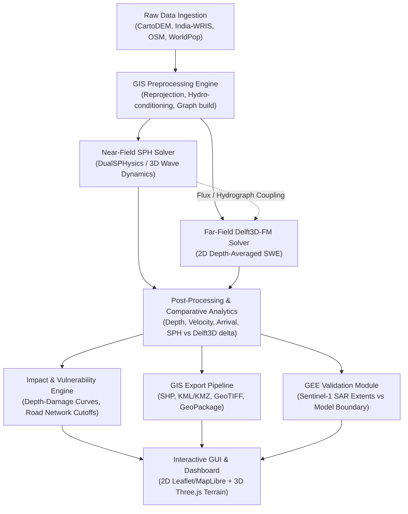

# SIH26161: Automated Dam-Break Simulation & Inundation Analysis Framework

## 1. Project Overview & Goal

**SIH26161** is an automated computational framework designed to simulate, analyze, and visualize dam-break flood wave propagation and its socio-economic impacts. The system bridges high-fidelity computational fluid dynamics with regional hydrodynamics by coupling:
1. **Smoothed Particle Hydrodynamics (SPH)** for near-field violent free-surface dam-break breach and wave generation.
2. **Delft3D (Flexible Mesh / 2D Shallow Water Equations)** for far-field downstream valley propagation, inundation spreading, and recession.
3. **Multi-Sector Vulnerability & Damage Engine** assessing infrastructure, agricultural, building, and road network disruptions.
4. **Interactive 2D/3D Visualization GUI** enabling emergency planners and dam safety engineers to configure breach scenarios, inspect flood hydrodynamics, and export decision-ready GIS layers.
5. **Earth Observation (GEE / Sentinel-1 SAR) Validation Pipeline** providing automated change detection and flood extent calibration against historical satellite observations.

---

## 2. Core Functional Requirements

* **Automated Data Ingestion & Preprocessing**:
  * Seamless ingest of high-resolution digital elevation models (DEMs), bathymetry, and reservoir stage-storage curves.
  * Standardized reprojection into planar metric CRS (e.g. UTM Zone 43N / EPSG:32643) with hydro-enforcement and sink filling.
  * Ingestion of OpenStreetMap (OSM) infrastructure assets, critical facilities, and road network topologies.
* **Dual-Engine Hydrodynamic Modeling & Intercomparison**:
  * Coupling/comparison between Lagrangian particle hydrodynamics (SPH, e.g. DualSPHysics / SPHysics) and Eulerian shallow water solvers (Delft3D-FM / D-Flow FM).
  * Automated generation of peak inundation depth ($h_{max}$), peak velocity ($v_{max}$), flood wave arrival time ($t_{arr}$), and depth-velocity hazard rating ($H = h \times v$).
* **Asset Exposure & Evacuation Analytics**:
  * Intersecting flood extents with critical infrastructure (buildings, schools, hospitals, power substations).
  * Network accessibility routing using road graphs (GraphML / OSMnx) to identify severed bridges, submerged road segments, and isolated population clusters.
* **Interoperable Geospatial Export**:
  * Automated batch export to standard GIS formats: ESRI Shapefile (`.shp`), Keyhole Markup Language (`.kml` / `.kmz`), GeoPackage (`.gpkg`), and Cloud-Optimized GeoTIFF (`.tif`).
* **Remote Sensing Verification**:
  * Google Earth Engine (GEE) integration for automated Sentinel-1 C-band SAR backscatter thresholding (Otsu method) to validate model-predicted inundation boundaries against actual historical flood footprints.
* **Modern Decision-Support GUI**:
  * Interactive map viewer with temporal playback of flood wave progression, 3D terrain rendering (WebGL / Three.js), scenario comparison dashboards, and one-click evacuation report generation.

---

## 3. System Architecture

---

## 4. Technology Stack

* **Core Language & Backend**: Python 3.10+ (NumPy, SciPy, Numba, Pandas).
* **Geospatial Processing**: GDAL / OGR, Rasterio, GeoPandas, Shapely, PyProj, Fiona.
* **Network & Graph Analytics**: NetworkX, OSMnx, SciPy Spatial (cKDTree).
* **Remote Sensing**: Google Earth Engine Python API (`earthengine-api`), Geemap.
* **Hydrodynamic Modeling Interfaces**:
  * Delft3D-FM / D-Flow FM OpenDA / Dimr tools and netCDF4 UGRID parsers.
  * SPH particle file converters (VTK, CSV, HDF5) and SPH-to-raster surface interpolators.
* **3D Visualization & Front-End**:
  * WebGL, Three.js, `geotiff.js` (browser-based 3D terrain elevation).
  * Desktop / Web GUI: Electron / Modern Web View or PyQt/PySide6 with MapLibre GL / Leaflet tile renderers.
* **Data Storage & Serialization**: GeoTIFF, GeoPackage (`.gpkg`), GeoJSON, GraphML, netCDF4.

---

## 5. Current Workspace Datasets & Characterization

#### 5.1 Hidkal Dam Case Study (`data/raw/data_hidkal/`)
* **`hidkal_dem.tif`**: 700 x 600 Float32, EPSG:4326. Pixel size: 0.0004° x 0.00033333° (~44.4 m x ~36.9 m). Bounds: 74.60°E - 74.88°E, 16.12°N - 16.32°N. Numeric range: 600.0001 to 682.5; elevation unit and vertical datum unverified.
* **`hidkal_depth.tif`**: 700 x 600 Float32, EPSG:4326. Depth zero: 284,904; positive: 135,096; max: 13.3386. Unverified sample raster of unknown provenance.
* **`hidkal_velocity.tif`**: 700 x 600 Float32, EPSG:4326. Velocity zero: 294,000; positive: 126,000; max: 21.5660. Unverified sample raster of unknown provenance.
* **`hidkal_arrival.tif`**: 700 x 600 Float32, EPSG:4326. Total pixels: 420,000; `+9999`: 294,000; valid: 126,000; `-9999`: 0; metadata NoData: `-9999`; valid range: 7.0–66.5, unit unknown. Unverified sample raster of unknown provenance.
* **`hidkal_assets.geojson`**: 513 OSM infrastructure features (333 building polygons, 102 transport/bridge linestrings, 78 place/amenity points).
* **`hidkal_roads.graphml`**: OSMnx-derived routable directed network with 3,084 nodes and 8,047 edges with length, highway type, lanes, and geometry attributes.

### 5.2 Standalone Terrain Demo (`data/raw/tifToTerrain/`)
* **`default.tif`**: Tiled Int16 GeoTIFF, 219 x 346 pixels, EPSG:4326. Bounds: 70.81°E - 70.87°E, 22.76°N - 22.86°N (Morbi district, Gujarat). Located ~760 km northwest of Hidkal.
* **`new.html`**: Three.js WebGL terrain demo with smoothing filter. Kept strictly segregated as an architectural reference for client-side 3D rendering.

---

## 6. Known vs. Unknown Units & Parameter Specifications

| Parameter | Current Representation | Status | Scientific Assessment & Target Unit |
| :--- | :--- | :--- | :--- |
| **Topography (`dem`)** | Float32, 600.0001 to 682.5 | **Unverified** | Numeric range 600.0001–682.5; elevation unit and vertical datum unverified. |
| **Flood Depth (`depth`)** | Float32, max 13.3386 | **Unverified** | Depth zero: 284,904; positive: 135,096. Unverified sample raster of unknown provenance. |
| **Velocity (`velocity`)** | Float32, max 21.5660 | **Unverified** | Velocity zero: 294,000; positive: 126,000. Unit unverified; unverified sample raster of unknown provenance. |
| **Arrival Time (`arrival`)** | Float32, 7.00 to 66.50 | **Unknown / Inconsistent** | Total pixels: 420,000; `+9999`: 294,000; valid: 126,000; `-9999`: 0; metadata NoData: `-9999`; valid range: 7.0–66.5, unit unknown. Unverified sample raster of unknown provenance. |
| **NoData Encoding** | `-9999` in header vs `9999.0` in array | **Inconsistent** | Tag discrepancy detected in `hidkal_arrival.tif`. Must be normalized to standard IEEE NaN or explicit masking. |
| **Spatial Coordinate System** | EPSG:4326 (Degrees) | **Known (Geographic)** | Non-metric. Must be reprojected to UTM Zone 43N (meters) for slope, flux, and area calculations. |

---

## 7. Scientific & Physical Limitations

1. **Unverified Simulation Warning**:
   > [!WARNING]
   > The existing flood rasters (`hidkal_depth.tif`, `hidkal_velocity.tif`, `hidkal_arrival.tif`) are **unverified sample rasters of unknown provenance**. They must **never** be presented as validated hydrodynamic simulations or official hazard boundaries. Formal calibration against mass conservation, inflow breach hydrographs, downstream channel roughness (Manning's $n$), and real event records is mandatory before operational use.

2. **SPH vs. Delft3D Multi-Scale Discrepancies**:
   * *SPH*: Lagrangian particle method solving Navier-Stokes equations with free surface tracking. Highly accurate for steep 3D wave fronts, splash, turbulence, and impact forces on dam structures, but computationally prohibitive for large regional floodplains ($>10^7$ particles required).
   * *Delft3D-FM*: Eulerian 2D Shallow Water Equations (SWE) assuming hydrostatic pressure distribution ($\partial p/\partial z = -\rho g$). Exceptional computational efficiency and bed friction representation for 10s-100s of kilometers downstream, but incapable of capturing vertical accelerations, 3D wave breaking, or structural slamming at the breach initiation zone.
   * *Coupling Challenge*: Handshake interface between 3D particle fluxes and 2D mesh boundary conditions requires rigorous momentum and mass conservation conversion.

3. **Geographic Coordinate Distortions**:
   * In EPSG:4326, pixel dimensions are anisotropic ($0.0004^\circ \approx 44.4\text{ m}$ lon vs $0.00033333^\circ \approx 36.9\text{ m}$ lat at $16^\circ\text{N}$). Direct spatial kernel operations in geographic degrees introduce directional bias.

4. **Arrival NoData Mismatch**:
   * The `hidkal_arrival.tif` raster contains `+9999.0` for 294,000 unflooded cells despite declaring `-9999` in metadata. This requires an explicit data sanitizer before running spatial statistics or visualization color ramps.

5. **Disconnection of `default.tif`**:
   * `default.tif` lies in Morbi, Gujarat, while Hidkal is in Belagavi, Karnataka. It must not be mixed into the Hidkal analytical pipeline.
