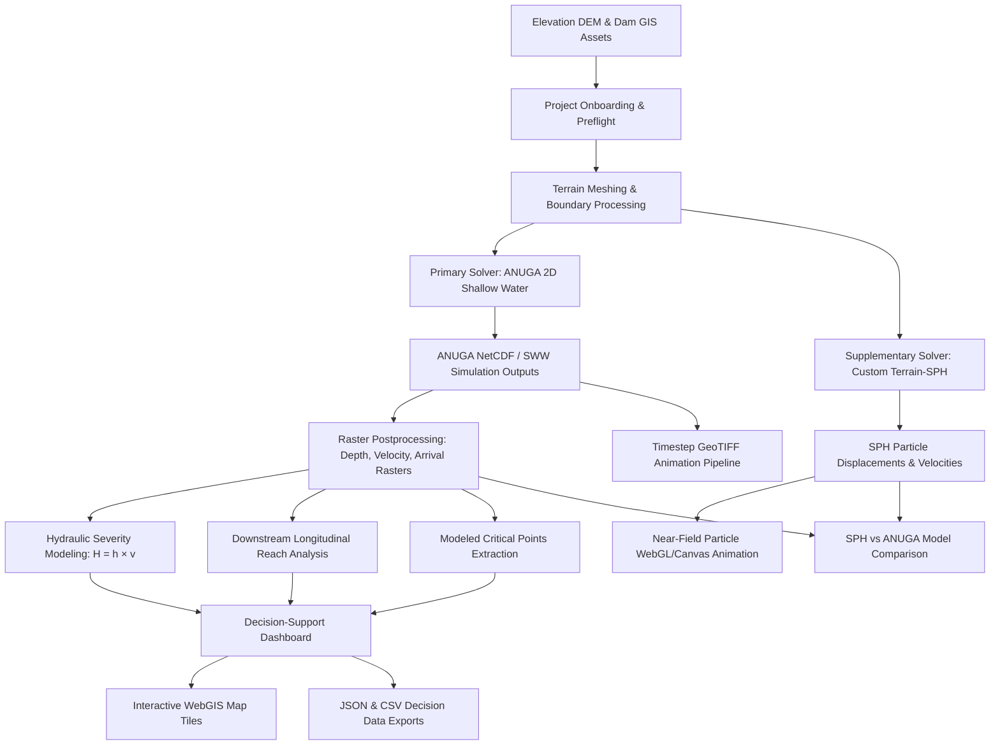

# Dam-Break & Flood Routing: Final System Architecture

## Overview
This platform is a comprehensive 2D hydrodynamic dam-break flood routing and decision-support demonstration system developed for the Smart India Hackathon (SIH). It integrates digital elevation ingestion, 2D shallow-water finite volume routing (ANUGA), near-field particle hydrodynamic demonstration (Custom Terrain-SPH), interactive WebGIS visualization (MapLibre GL), and decision-support analytics.

---

## High-Level Architecture Pipeline



---

## Core Components & Technologies

### 1. Data Ingestion & Geometry Validation
* **Digital Elevation Data**: Global SRTM 1-arcsecond (~30 m grid) or custom GeoTIFF elevation models.
* **Spatial Reprojection & Alignment**: PyProj and Rasterio reprojection to local UTM coordinate reference systems (e.g., EPSG:32643 for Hidkal Dam).
* **Vector Geometries**: Delineated dam crest axis, reservoir boundary polygon, breach location point, and downstream outlet bounds using Shapely and GeoPandas.

### 2. Primary Regional Solver: ANUGA 2D SWE
* **Mathematical Model**: Non-linear shallow-water wave equations (depth-averaged conservation of mass and momentum) with shock-capturing discontinuous Galerkin / finite-volume schemes over an unstructured triangular mesh.
* **Outputs**: Full regional inundation depth ($h$), flow velocity magnitude ($v$), arrival travel time ($t_{\text{arr}}$), and time-series `.sww` binary datasets.
* **Role**: Primary authority for multi-kilometer downstream flood routing, arrival timing, inundated area, and decision-support indicators.

### 3. Supplementary Near-Field Solver: Custom Terrain-SPH
* **Mathematical Model**: Smoothed Particle Hydrodynamics (SPH) simulating near-field breach throat fluid collapse, free-surface wave deformation, and fluid-structure barrier interaction in the immediate vicinity of the dam (2D depth-integrated particle approximation).
* **Outputs**: Time-stamped Lagrangian particle states $(x, y, z, u, v, w, \rho, p)$ converted to raster footprints and 2D canvas particle animation frames.
* **Role**: Supplemental near-field visual demonstration of initial breach burst dynamics.

### 4. Postprocessing & Raster Tile Service
* **Dynamic Web Mercator Tiles**: High-performance XYZ tile endpoints (`/decision-support/tiles/{layer}/{z}/{x}/{y}.png` and `/rasters/{id}/tiles/{z}/{x}/{y}.png`) using Rio-Tiler, Rasterio, and PIL for real-time color-ramp rendering and transparency masking without loading whole rasters into memory.
* **Hydraulic Severity Generation**: Automatically computes $H(x, y) = h_{\max}(x,y) \times v_{\max}(x,y)$ on the native simulation grid.

### 5. Decision-Support Engine
* **KPI Summaries**: Computes maximum water depth, maximum flow velocity, total inundated area ($h \ge 0.05\text{ m}$), domain percentage, downstream reach, and first downstream arrival.
* **Downstream Arrival Intelligence**: Excludes initially wet reservoir cells ($t = 0\text{ s}$) to measure true downstream flood front arrival progression.
* **Downstream Reach Segmentation**: 250 m longitudinal distance bands assessing flood wave attenuation.
* **Critical Points Detection**: Identifies peak depth, peak velocity, earliest arrival, highest severity, and farthest reach with WGS84 (Lat/Lon) and UTM coordinates.

### 6. Interactive Frontend (React + TypeScript + Vite + MapLibre GL)
* **MapLibre GL JS**: Hardware-accelerated GPU map rendering for multi-layer raster overlays, animated particles, and interactive vector markers.
* **Lightweight Responsive Dashboards**: Native SVG charts for depth and velocity distributions, high-contrast KPI cards, and demo readiness badges.
* **Presenter Quick Navigation**: Instant switching across scenario overview, ANUGA flood propagation, SPH near-field animation, decision-support analytics, and model comparison.

---

## Data Flow & Storage Structure

```
backend/data/dam_projects/
└── {project_id}/
    ├── project.json                    # Project definition & metadata
    ├── dem.tif                         # Base elevation raster (SRTM 30m)
    ├── runs/                           # ANUGA Regional Simulation Runs
    │   └── {anuga_run_id}/
    │       ├── run.json                # Execution parameters & status
    │       ├── simulation.sww          # ANUGA binary output
    │       └── results/
    │           ├── maximum_depth.tif   # Peak water depth raster (m)
    │           ├── maximum_velocity.tif# Peak flow velocity raster (m/s)
    │           ├── arrival_time.tif    # Earliest arrival time raster (s)
    │           ├── hydraulic_severity.tif # Product H = h * v (m²/s)
    │           └── timesteps/          # Time-series frame GeoTIFFs
    └── sph/runs/                       # Custom Terrain-SPH Near-Field Runs
        └── {sph_run_id}/
            ├── run.json                # Execution metadata
            ├── maximum_depth.tif       # Near-field depth envelope
            └── frames/                 # Particle JSON/binary frames
```

---

## Security, Isolation, and Error Resilience
* **Project & Run UUID Validation**: All API paths strictly validate standard UUID formatting, preventing path traversal attacks.
* **Fallback Demo Mode**: Pre-validated demonstration runs are automatically recognized and cached, allowing live presentations to function smoothly without recomputing multi-gigabyte models under live judging time constraints.
